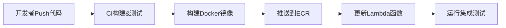
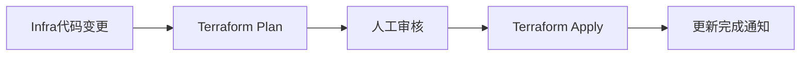

# 企业级无服务器架构改进方案

## 🎯 目标架构

### 仓库分离策略
```
users-service/                    # 用户服务仓库
├── src/
│   ├── handlers/
│   ├── models/
│   └── utils/
├── tests/
├── Dockerfile
├── serverless.yml               # Serverless Framework
├── .github/workflows/ci.yml
└── README.md

products-service/                # 产品服务仓库  
├── src/
├── tests/
├── Dockerfile
└── ...

infrastructure/                  # 基础设施仓库
├── environments/
│   ├── dev/
│   ├── staging/
│   └── prod/
├── modules/
│   ├── api-gateway/
│   ├── lambda/
│   └── rds/
├── main.tf
└── README.md
```

## 🔄 CI/CD 流程

### 1. 服务开发流程


### 2. 基础设施更新流程


## 📚 技术栈选择

### 代码管理
- **Serverless Framework**: 专门为无服务器应用设计
- **AWS SAM**: AWS原生无服务器应用框架  
- **Terraform**: 基础设施即代码

### CI/CD工具
- **GitHub Actions**: 代码自动化
- **AWS CodePipeline**: AWS原生CI/CD
- **GitLab CI**: 企业级选择

## 🛠️ 实施步骤

1. **分离代码库**
   - 创建独立的服务仓库
   - 迁移Lambda代码
   - 设置CI/CD流水线

2. **基础设施解耦**  
   - 移除硬编码的代码路径
   - 使用容器镜像部署
   - 参数化配置管理

3. **统一发布流程**
   - 服务独立发布
   - 基础设施版本管理
   - 环境一致性保证
