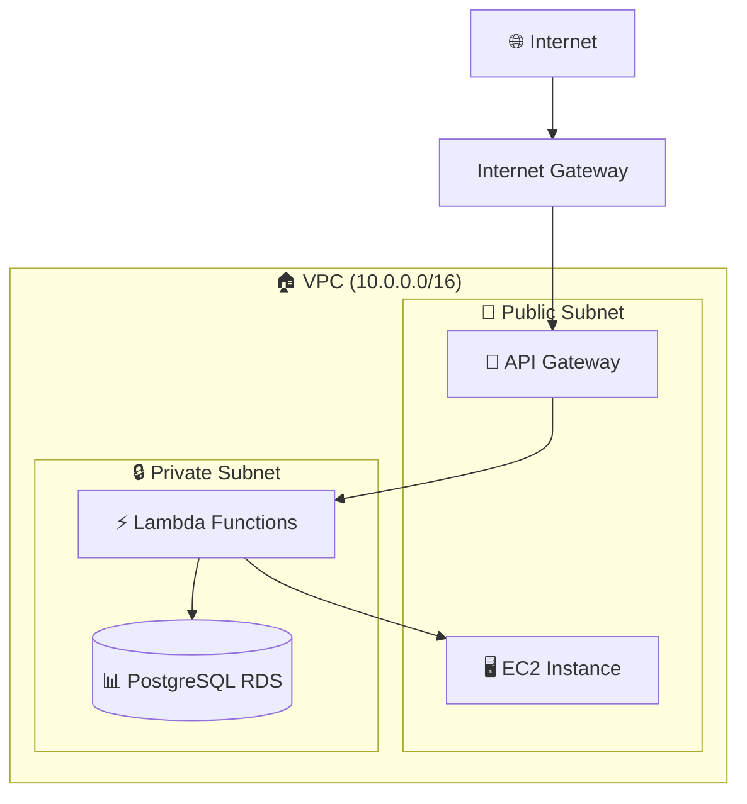

# 🏗️ TFBoys 架构文档

## 📊 总体架构

### 🎯 Monorepo 结构
```
tfboys/
├── backend/                 # 🚀 Go 微服务
│   ├── services/
│   │   ├── users/          # 用户服务API
│   │   └── products/       # 产品服务API
│   └── shared/             # 共享代码
├── infrastructure/          # 🏗️ AWS 基础设施 (Terraform)
│   ├── modules/            # 可复用模块
│   ├── environments/       # 环境配置
│   └── scripts/           # 部署脚本
└── docs/                   # 📚 项目文档
```

## 🔧 技术栈

### 后端服务
- **语言**: Go 1.21
- **架构**: Serverless (AWS Lambda)
- **API**: RESTful + API Gateway
- **认证**: API Key
- **数据库**: PostgreSQL (RDS)

### 基础设施
- **IaC**: Terraform
- **云平台**: AWS
- **网络**: VPC + 公有/私有子网
- **监控**: CloudWatch Logs
- **安全**: Security Groups + IAM

## 🌐 网络架构



## 🔄 数据流

### API请求流程
1. **客户端** → API Gateway (+ API Key验证)
2. **API Gateway** → Lambda Function (users/products)
3. **Lambda** → RDS PostgreSQL (数据操作)
4. **响应返回** ← ← ← 

### 部署流程
1. **代码构建**: Go → 优化的Linux二进制
2. **打包部署**: ZIP → Lambda Function
3. **基础设施**: Terraform → AWS资源
4. **配置管理**: 环境变量 + 参数

## 📈 性能优化

### Lambda优化
- ✅ **构建优化**: `-ldflags='-s -w'` 减少31%文件大小
- ✅ **VPC配置**: 专用安全组 + 私有子网
- ✅ **内存配置**: 256MB (开发) / 512MB (生产)
- ✅ **超时设置**: 15s (开发) / 30s (生产)

### 数据库优化
- ✅ **实例类型**: t3.micro (开发) / t3.small+ (生产)
- ✅ **网络隔离**: 私有子网 + 安全组
- ✅ **备份策略**: 7天保留期
- ✅ **监控**: CloudWatch集成

## 🔒 安全架构

### 网络安全
- **VPC隔离**: 独立的网络环境
- **子网分层**: 公有/私有子网隔离
- **安全组**: 最小权限原则

### API安全
- **API Key**: 请求级别认证
- **使用计划**: 限流 + 配额控制
- **HTTPS**: 所有通信加密

### 数据安全
- **数据库**: 私有子网 + 安全组
- **传输**: TLS加密
- **访问**: IAM角色权限控制

## 🌍 多环境支持

### 环境隔离
```
dev (开发)     → 低配置 + 宽松限制
staging (预发布) → 中等配置 + 中等限制  
prod (生产)    → 高配置 + 严格限制
```

### 配置管理
- **Terraform**: 环境特定的 `.tfvars`
- **Lambda**: 环境变量注入
- **API Gateway**: 分环境Stage

## 📊 监控 & 可观测性

### 日志系统
- **API Gateway**: 访问日志
- **Lambda**: CloudWatch Logs
- **应用日志**: 结构化JSON格式

### 指标监控
- **性能**: 响应时间 + 吞吐量
- **错误**: 错误率 + 错误类型
- **资源**: CPU + 内存使用率

## 🔄 扩展规划

### 水平扩展
- **Lambda**: 自动扩缩容 (1000+ 并发)
- **API Gateway**: 无限制吞吐
- **RDS**: 读取副本 + 连接池

### 垂直扩展
- **Lambda内存**: 根据负载调整
- **RDS实例**: 按需升级
- **API限制**: 动态调整
